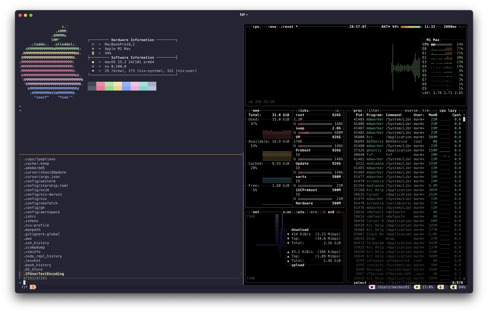

# marmos91 dotfiles

Cross-platform dotfiles for **macOS**, **Linux** (Ubuntu/GNOME), and **Windows** (via WSL2), powered by Nix, Home Manager, and Stow.



## Highlights

- **Cross-platform**: Works on macOS (Apple Silicon & Intel), Linux (x86_64 & aarch64), and Windows (via WSL2)
- **Declarative configuration**: Managed with [Nix Darwin](https://github.com/LnL7/nix-darwin) (macOS) and [Home Manager](https://github.com/nix-community/home-manager) (Linux)
- **Consistent theming**: [Catppuccin Mocha](https://github.com/catppuccin/catppuccin) across all tools via [catppuccin/nix](https://github.com/catppuccin/nix)
- **Terminal emulators**: [Ghostty](https://github.com/ghostty-org/ghostty), [Kitty](https://sw.kovidgoyal.net/kitty/), [WezTerm](https://wezfurlong.org/wezterm/index.html) (also native on Windows)
- **Shell**: Zsh with [Starship](https://starship.rs/) prompt
- **Editor**: [Neovim](https://neovim.io/) with custom Lua configuration
- **Terminal multiplexer**: [Tmux](https://github.com/tmux/tmux/wiki) with catppuccin theme

## Installation

Clone the repository:

```bash
git clone https://github.com/marmos91/dotfiles.git ~/.dotfiles
cd ~/.dotfiles
```

Run the install script:

```bash
chmod +x install.sh && ./install.sh
```

### Options

| Flag | Description |
|------|-------------|
| `--shell <shell>` | Set default shell (`zsh` or `bash`). Default: `zsh` |
| `--shell-only` | Only change the default shell, skip full installation |
| `--hostname <name>` | Set hostname (macOS only). Default: `amaterasu` |
| `--no-stow` | Skip stowing dotfiles |
| `--skip-nix` | Skip Nix installation (use existing Nix) |
| `--no-1password` | Skip 1Password installation (Linux only) |
| `--help` | Show help message |

**Examples:**

```bash
./install.sh                          # Full install with defaults
./install.sh --shell bash             # Install with bash as default shell
./install.sh --hostname myhost        # Install with custom hostname (macOS)
./install.sh --shell-only             # Only set zsh as default (skip install)
./install.sh --no-stow --skip-nix     # Only apply Nix configuration
./install.sh --no-1password           # Skip 1Password installation on Linux
```

### What it does

1. Install [Stow](https://www.gnu.org/software/stow/) (via Homebrew on macOS, apt/dnf/pacman on Linux)
2. Install [Nix](https://nixos.org/) using the [Determinate Systems installer](https://determinate.systems/nix-installer/)
3. Install [1Password](https://1password.com/) via official apt repository (Linux only, for SSH agent)
4. Symlink dotfiles to your home directory via Stow
5. Apply the appropriate Nix configuration:
   - **macOS**: nix-darwin + home-manager
   - **Linux**: standalone home-manager
   - **WSL2**: standalone home-manager, auto-detected, using a WSL-specific configuration (skips GNOME/GUI-terminal modules; see [Windows](#windows-via-wsl2) below)
6. Set the default shell (Linux only)

### 1Password SSH Agent Setup

This configuration uses 1Password for SSH key management and Git commit signing. After installation:

1. **Open 1Password** and sign in to your account
2. **Enable SSH Agent**: Go to **Settings → Developer** and enable:
   - "Use the SSH agent"
   - "Integrate with 1Password CLI"
3. **Add your SSH key** to 1Password (if not already there)
4. **Authorize the key** for Git signing when prompted

The git configuration automatically uses 1Password's `op-ssh-sign` for commit signing:
- **macOS**: `/Applications/1Password.app/Contents/MacOS/op-ssh-sign`
- **Linux**: `/opt/1Password/op-ssh-sign`

To verify it's working:

```bash
# Test SSH agent
ssh-add -l

# Test commit signing
echo "test" | git commit --allow-empty -m "Test signed commit"
git log --show-signature -1
```

**Note**: On macOS, install 1Password from the [Mac App Store](https://apps.apple.com/app/1password-7-password-manager/id1333542190) or [official download](https://1password.com/downloads/mac/).

### Post-install

Restart your terminal or log out/in for all changes to take effect.

## Windows (via WSL2)

Nix has no native Windows support, so Windows is set up in two parts:

1. **WSL2** hosts the real, Nix-managed environment — shell, Neovim, tmux, dev
   toolchains, git. This reuses the exact same `install.sh` path as Linux
   (auto-detected, uses the `<username>-wsl` home-manager configuration).
2. **Native Windows** gets a small, explicitly non-Nix PowerShell layer for
   what WSL2 can't reach: installing GUI apps, WezTerm, system preferences,
   and taskbar pins.

### Prerequisites

- Windows 10 2004+ (build 19041+) or Windows 11, 64-bit, with virtualization
  enabled (checked automatically — see Step 0 below).
- `git` for Windows to clone this repo (`winget install Git.Git` if you don't
  have it yet).

### One-command setup

Open **PowerShell as Administrator** (Start → type "PowerShell" → right-click
→ "Run as Administrator") — do this up front rather than letting the script
self-elevate, so all output stays in the window you're watching instead of
a second window that closes when it's done.

```powershell
git clone https://github.com/marmos91/dotfiles.git $env:USERPROFILE\.dotfiles
cd $env:USERPROFILE\.dotfiles\windows
powershell -ExecutionPolicy Bypass -File .\bootstrap.ps1
```

(`-ExecutionPolicy Bypass` is needed since the script isn't signed.)

Preview what it would do first with `.\bootstrap.ps1 -DryRun` (no admin
needed for a dry run).

`bootstrap.ps1` is safe to run more than once — every step checks its current
state first. What it does:

0. Checks prerequisites (Windows build, 64-bit, virtualization/hypervisor
   presence, free disk space, winget availability) and stops early with a
   clear reason if a hard requirement isn't met.
1. Installs WSL2 + Ubuntu if missing. **If this is the first time WSL has
   been enabled on the machine, Windows will require a reboot** — after it
   reboots, Ubuntu launches itself and asks you to create a UNIX username
   and password; that part is interactive and can't be scripted. Once
   that's done, re-run the same command above and it'll pick up where it
   left off.
2. Clones this repo into WSL and runs `install.sh` there (same Linux path as
   above) — this will prompt for your `sudo` password inside WSL a few
   times, which is normal.
3. Installs GUI apps via `winget` from [`windows/apps.txt`](./windows/apps.txt).
   A few packages (Visual Studio, Docker Desktop) may pop their own installer
   UI despite the silent flags — let them finish.
4. Applies system preferences (max keyboard repeat speed, dark theme, show
   file extensions), disables Start menu/lock screen/Settings ads and
   suggestions (mirroring `system/preferences.nix`), and removes common
   preinstalled bloatware (Solitaire, Candy Crush, Facebook, Skype, Cortana,
   etc. — see the list in `bootstrap.ps1`).
5. Writes a WezTerm config (`%USERPROFILE%\.config\wezterm\wezterm.lua`) with
   the same Catppuccin Mocha theme as macOS/Linux, configured to open
   straight into WSL2.
6. Best-effort pins the same app set to the taskbar as the macOS Dock's
   `persistent-apps`. Taskbar pinning is an undocumented Windows API that
   Microsoft has changed across releases — if it's a no-op on your build,
   pin manually (right-click an app → **Pin to taskbar**).

### What's still manual

1Password's WSL integration requires an interactive login, so it can't be
scripted:

1. Open 1Password for Windows and sign in.
2. **Settings → Developer** → enable "Use the SSH agent" and check this WSL
   distro under SSH agent integration.
3. Verify from inside WSL: `ssh-add.exe -l`.

## Uninstallation

To completely remove the dotfiles and Nix:

```bash
chmod +x uninstall.sh && ./uninstall.sh
```

### Options

| Flag | Description |
|------|-------------|
| `--dotfiles-only` | Only unstow dotfiles, keep Nix and packages |
| `--keep-nix` | Keep Nix installed, remove dotfiles and config |
| `--keep-stow` | Keep stow installed |
| `--keep-1password` | Keep 1Password installed (Linux only) |
| `-y, --yes` | Skip confirmation prompt |
| `--help` | Show help message |

**Examples:**

```bash
./uninstall.sh                    # Full uninstall (interactive)
./uninstall.sh -y                 # Full uninstall (no confirmation)
./uninstall.sh --dotfiles-only    # Only remove dotfile symlinks
./uninstall.sh --keep-nix         # Remove dotfiles but keep Nix
./uninstall.sh --keep-1password   # Keep 1Password installed on Linux
```

### What it removes

1. Dotfile symlinks (unstow)
2. Stow (unless `--keep-stow`)
3. 1Password app and CLI (Linux, unless `--keep-1password`)
4. Home-manager/nix-darwin configuration
5. Nix and all packages (unless `--keep-nix`)
6. Nix cache files

**Warning**: Full uninstall is destructive and will remove all Nix-installed packages.

## Usage

After installation, use the `rebuild` command to apply configuration changes:

```bash
rebuild
```

This automatically detects your platform and runs the appropriate command:
- **macOS**: `darwin-rebuild switch --flake ~/.config/nix-darwin`
- **Linux**: `home-manager switch --flake ~/.config/nix-darwin`

## Structure

```
~/.dotfiles/
├── .config/
│   ├── nix-darwin/          # Nix configuration
│   │   ├── flake.nix        # Main flake (inputs & outputs)
│   │   ├── system/          # macOS system config (nix-darwin)
│   │   └── home/            # User config (home-manager)
│   │       ├── catppuccin.nix      # Global theme config
│   │       ├── programs/
│   │       │   ├── desktop/        # GNOME settings (Linux)
│   │       │   ├── terminal/       # ghostty, tmux, starship
│   │       │   ├── shell/          # zsh, fish
│   │       │   ├── git/            # git, lazygit, delta
│   │       │   └── utilities/      # bat, fzf, btop, k9s, etc.
│   │       └── development/        # Language toolchains
│   └── nvim/                # Neovim configuration
├── windows/                  # Native Windows automation (non-Nix, WSL2 host setup)
│   ├── bootstrap.ps1         # Single entry point: WSL2, winget apps, prefs, WezTerm, taskbar
│   └── apps.txt              # winget package IDs to install
├── install.sh               # Installation script
├── uninstall.sh             # Uninstallation script
└── README.md
```

## Platform-specific features

### macOS
- Homebrew casks for GUI applications
- System preferences (Dock, Finder, keyboard)
- AeroSpace window manager

### Linux (Ubuntu/GNOME)
- GNOME settings via dconf (keyboard repeat, trackpad, dark mode)
- Dash-to-Dock extension with auto-hide
- GNOME Terminal with Catppuccin theme
- Window buttons on left (macOS-style)

### Windows (via WSL2)
- WSL2 + Ubuntu, running the same home-manager config as native Linux
- winget-installed GUI apps (see `windows/apps.txt`)
- System preferences (keyboard repeat, dark theme, file extensions) and
  ads/suggestions disabled via registry
- WezTerm with Catppuccin theme, launching straight into WSL2
- Taskbar pins mirroring the macOS Dock (best-effort)

## Customization

Key files to customize:

| Purpose | File |
|---------|------|
| Theme (flavor/accent) | `home/catppuccin.nix` |
| Shell aliases | `home/programs/shell/zsh.nix` |
| Git config | `home/programs/git/config.nix` |
| Neovim plugins | `.config/nvim/lua/plugins/` |
| Terminal settings | `home/programs/terminal/` |
| GNOME settings | `home/programs/desktop/gnome.nix` |
| Secrets management | `home/secrets/` ([README](.config/nix-darwin/home/secrets/README.md)) |
| Windows apps (winget) | `windows/apps.txt` |
| Windows preferences/taskbar | `windows/bootstrap.ps1` |

## License

[MIT LICENSE](./LICENSE)
